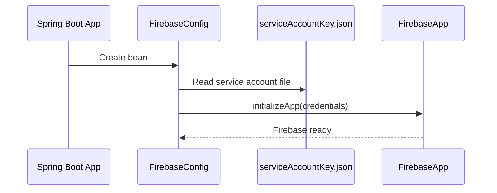
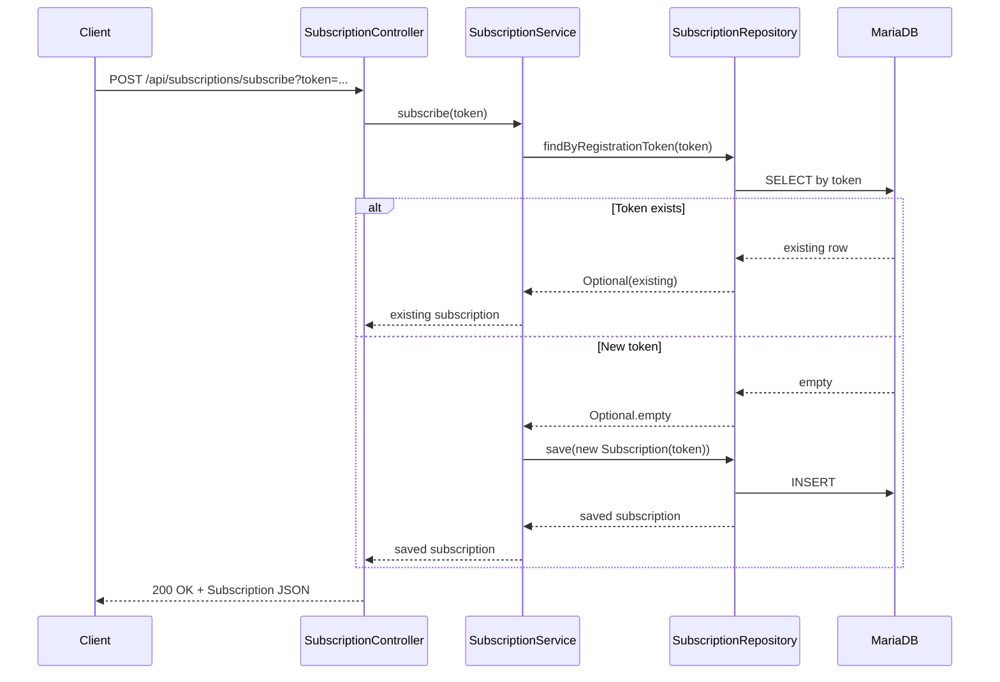
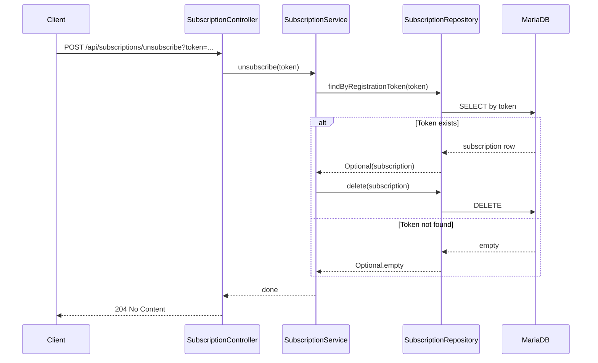
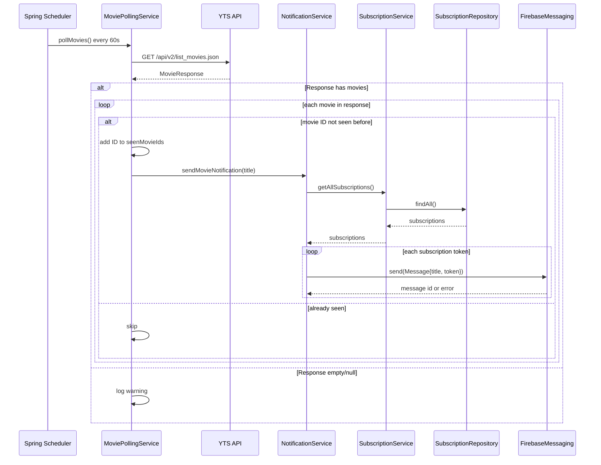

# Movie Notifier

Spring Boot service that polls YTS and sends Firebase push notifications for new movies.

## What It Does

- Polls movie data on a schedule.
- Avoids duplicate notifications.
- Sends push notifications through Firebase Admin SDK.
- Supports JVM run and GraalVM native executable builds.

## Project Layout

- App entrypoint: `src/main/java/com/example/movienotifier/MovieNotifierApplication.java`
- Data source config: `src/main/java/com/example/movienotifier/config/DataSourceConfig.java`
- Main config: `src/main/resources/application.properties`
- Native reflection config: `src/main/resources/META-INF/native-image/com.example/movie-notifier/reflect-config.json`
- Native build script: `build-native.sh`

## Architecture Diagram

```mermaid
flowchart LR
    Client[Client App]
    API[SubscriptionController\n/api/subscriptions]
    SubSvc[SubscriptionService]
    Repo[(SubscriptionRepository\nMariaDB)]
    Poll[MoviePollingService\n@Scheduled every 60s]
    YTS[YTS API\nlist_movies.json]
    Notif[NotificationService]
    FCM[Firebase Cloud Messaging]
    Device[Subscriber Device]

    Client -->|POST subscribe/unsubscribe| API
    API --> SubSvc
    SubSvc --> Repo

    Poll -->|GET movies| YTS
    Poll -->|new movie title| Notif
    Notif --> SubSvc
    SubSvc --> Repo
    Notif -->|send message| FCM
    FCM --> Device
```

## Service Flows (Sequence Diagrams)

### Startup and Firebase Initialization



### Subscribe Flow



### Unsubscribe Flow



### Scheduled Polling and Notification Flow



## Prerequisites

- Linux (script is Bash-based).
- Java 25 only.
- GraalVM Java 25 installed at `/opt/graalvm-amd64` for local AMD64 native builds (or adapt `build-native.sh`).
- Docker + Buildx for AARCH64 cross-builds.
- Firebase key file: `serviceAccountKey.json` in project root.

## Known Good Build Matrix

This matrix is an evidence-backed snapshot from project files and recent local build logs, not a universal compatibility guarantee.

| Component | Version / Value | Source |
|---|---|---|
| Spring Boot plugin | `4.0.4` | `build.gradle` |
| GraalVM Native Build Tools plugin | `0.11.1` | `build.gradle` |
| Java source/target/toolchain | `25` | `build.gradle` |
| Native Graal launcher constraint | GraalVM Java `25` | `build.gradle` |
| Gradle wrapper | `9.1.0` | `gradle/wrapper/gradle-wrapper.properties` |
| Foojay resolver plugin | `0.9.0` | `settings.gradle` |
| Local AMD64 GraalVM path expected by script | `/opt/graalvm-amd64` | `build-native.sh` |
| Local Java path expected by script | `/opt/graalvm-amd64` | `build-native.sh` |
| ARM64 Docker image used by script | `ghcr.io/graalvm/native-image-community:25` | `build-native.sh` |
| Tomcat at native runtime (observed) | `11.0.18` | recent native run logs |
| Hibernate ORM at native runtime (observed) | `7.2.7.Final` | recent native run logs |

## Quick Verify (Java 25 only)

If you previously built with `sudo`, fix Gradle cache ownership first:

```bash
cd /path/to/movie-notifier
sudo chown -R "$USER":"$USER" .gradle
```

Verify wrapper + JVM toolchain:

```bash
cd /path/to/movie-notifier
./gradlew --version
./gradlew clean test
```

JVM run:

```bash
cd /path/to/movie-notifier
./gradlew bootRun
```

AMD64 native build and run:

```bash
cd /path/to/movie-notifier
./build-native.sh
cd build/native/nativeCompile
./movie-notifier-native
```

ARM64 cross-build (Docker Buildx + QEMU) and architecture check:

```bash
cd /path/to/movie-notifier
sudo ./build-native.sh aarch64
file build/native/nativeCompile/movie-notifier-native
```

## Run and Build Reference

Use `## Quick Verify (Java 25 only)` as the primary copy/paste flow.

- JVM task name is `bootRun` (not `runBoot`).
- Native build script is `./build-native.sh` (AMD64 local) or `./build-native.sh aarch64` (ARM64 cross-build).
- Native output directory is `build/native/nativeCompile`.
- Native binary path is `build/native/nativeCompile/movie-notifier-native`.
- Copied runtime files are `build/native/nativeCompile/application.properties` and `build/native/nativeCompile/serviceAccountKey.json` (if present).

## Subscription REST API

Base path: `/api/subscriptions`

### Subscribe

- Endpoint: `POST /api/subscriptions/subscribe`
- Input: required query parameter `token`
- Returns: `200 OK` with `Subscription` JSON

```bash
curl -X POST "http://localhost:8080/api/subscriptions/subscribe?token=<FCM_REGISTRATION_TOKEN>"
```

Example response (`200 OK`):

```json
{
  "id": 1,
  "registrationToken": "<FCM_REGISTRATION_TOKEN>",
  "subscribedAt": "2026-03-21T10:15:30.123456"
}
```

### Unsubscribe

- Endpoint: `POST /api/subscriptions/unsubscribe`
- Input: required query parameter `token`
- Returns: `204 No Content`

```bash
curl -X POST "http://localhost:8080/api/subscriptions/unsubscribe?token=<FCM_REGISTRATION_TOKEN>" -i
```

Validation note:

- Missing `token`: `400 Bad Request`

## Configuration

Main runtime config is in `src/main/resources/application.properties`.

Current app expects:

- `spring.datasource.url`
- `spring.datasource.username`
- `spring.datasource.password`
- `firebase.service-account-file=serviceAccountKey.json`

`DataSourceConfig` builds Hikari using `org.mariadb.jdbc.MariaDbDataSource` and passes URL/user/password as datasource properties.

## Native Notes

### Toolchain behavior

`build.gradle` uses:

- Spring Boot `4.0.4`
- Graal plugin `0.11.1`
- Java toolchain source/target 25
- Native launcher lookup for GraalVM Java 25

Java 21 is not supported by this repository configuration anymore.

If native compile fails with toolchain lookup errors, use `./build-native.sh` and verify GraalVM path in the script.

### Reflection metadata

Hibernate 7 on native may require explicit reflection entries. This project keeps them in:

- `src/main/resources/META-INF/native-image/com.example/movie-notifier/reflect-config.json`

Recent required entries include:

- `org.hibernate.event.spi.PreFlushEventListener[]`
- `org.hibernate.event.spi.PostFlushEventListener[]`

If you get `MissingReflectionRegistrationError` for another type, add that exact type in `reflect-config.json`, rebuild, and rerun.

## Troubleshooting

- `Task 'runBoot' not found`:
  - Use `./gradlew bootRun`.
- `./movie-notifier-native: No such file or directory`:
  - Build did not finish successfully. Re-run `./build-native.sh` and verify binary exists in `build/native/nativeCompile`.
- Native app starts but DB auth fails:
  - Check values in `application.properties` and that runtime config file is copied into native output directory.
- Native build fails with SLF4J image heap/provider errors:
  - Re-check native build args in `build.gradle` and use the project defaults.

## Security Reminder

Do not commit real production secrets.

- `serviceAccountKey.json` should stay private.
- Consider moving DB credentials to environment variables or external config for production.
