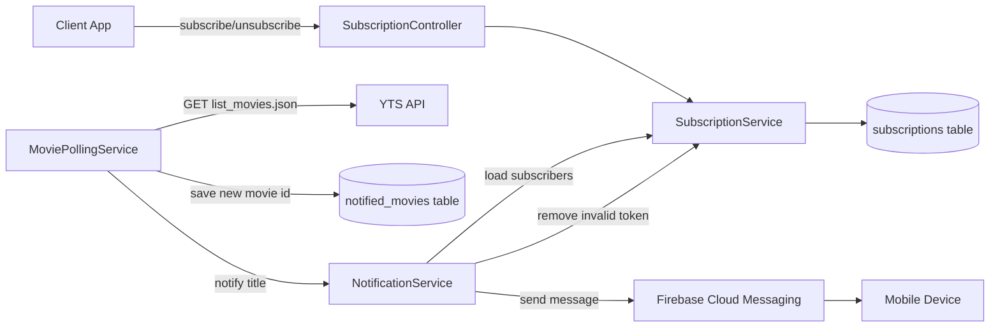
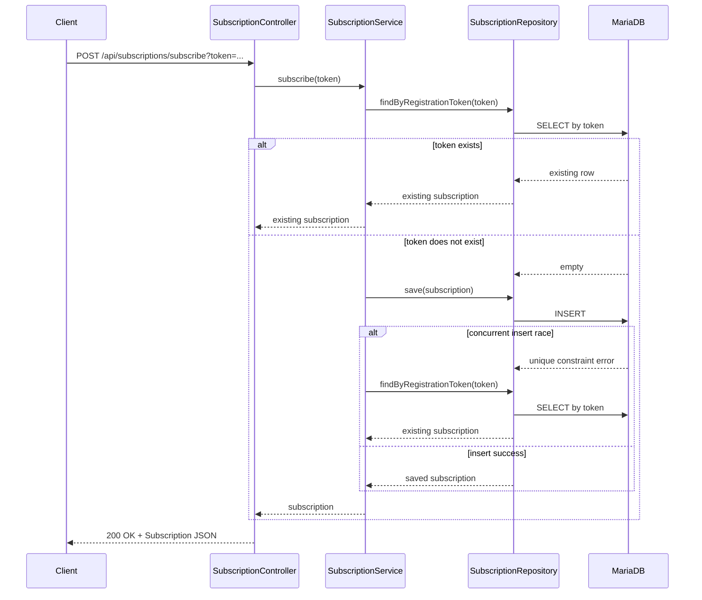
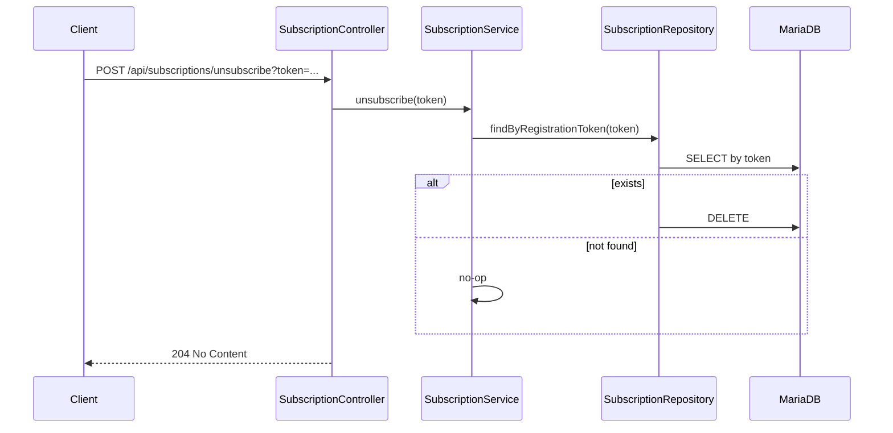
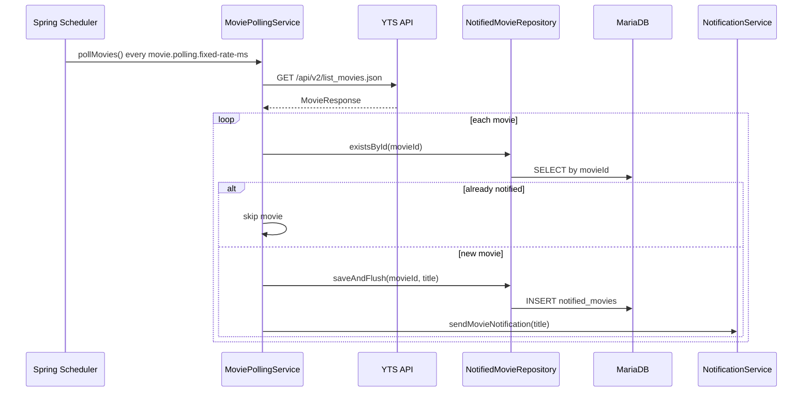
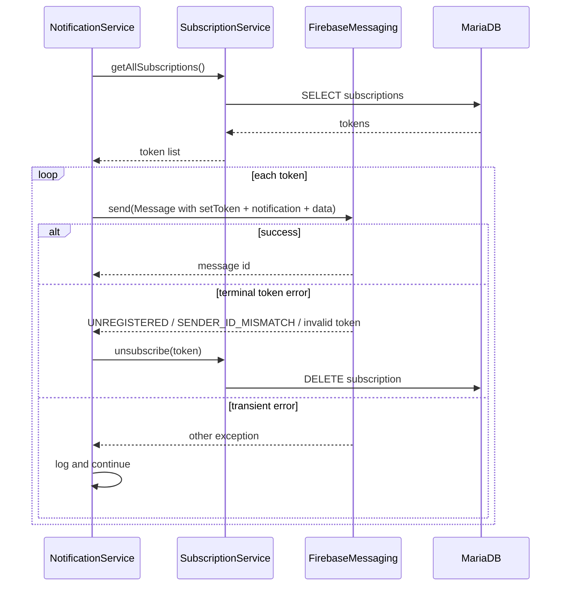

# Movie Notifier

Spring Boot service that polls YTS and sends Firebase Cloud Messaging (FCM) push notifications for new movies.

## What It Does

- Polls YTS on a configurable schedule.
- Persists notified movie IDs in `notified_movies` to avoid resend after restart.
- Manages FCM subscriptions through a single REST controller.
- Sends cross-platform push payloads (notification + data) via Firebase Admin SDK.
- Removes invalid/uninstalled device tokens when FCM returns terminal token errors.
- Supports JVM run and GraalVM native builds (AMD64 and ARM64).

## Project Layout

- Entrypoint: `src/main/java/ar/com/martinrevert/movienotifier/MovieNotifierApplication.java`
- Config package: `src/main/java/ar/com/martinrevert/movienotifier/config` (`DataSourceConfig`, `RestClientConfig`, `FirebaseConfig`, `SchedulingConfig`)
- Controller package: `src/main/java/ar/com/martinrevert/movienotifier/controller` (`SubscriptionController`)
- Service package: `src/main/java/ar/com/martinrevert/movienotifier/service` (`SubscriptionService`, `MoviePollingService`, `NotificationService`)
- Repository package: `src/main/java/ar/com/martinrevert/movienotifier/repository` (`SubscriptionRepository`, `NotifiedMovieRepository`)
- Model package: `src/main/java/ar/com/martinrevert/movienotifier/model` (`Subscription`, `NotifiedMovie`, `MovieResponse`)
- Runtime config file: `src/main/resources/application.properties`
- Native reflection config: `src/main/resources/META-INF/native-image/ar.com.martinrevert/movie-notifier/reflect-config.json`
- Native build script: `build-native.sh`

## Architecture



## Service Flows

### 1) Subscribe (idempotent)



### 2) Unsubscribe



### 3) Poll and dedupe using `notified_movies`



### 4) Notification send and invalid-token cleanup



## REST API

Base path: `/api/subscriptions`

### Subscribe

- `POST /api/subscriptions/subscribe?token=<FCM_REGISTRATION_TOKEN>`
- Returns `200 OK` and `Subscription` JSON.
- Repeating the same token is idempotent (returns existing subscription).

```bash
curl -X POST "http://localhost:10000/api/subscriptions/subscribe?token=<FCM_REGISTRATION_TOKEN>"
```

### Unsubscribe

- `POST /api/subscriptions/unsubscribe?token=<FCM_REGISTRATION_TOKEN>`
- Returns `204 No Content`.

```bash
curl -i -X POST "http://localhost:10000/api/subscriptions/unsubscribe?token=<FCM_REGISTRATION_TOKEN>"
```

Validation:

- Missing or blank `token` returns `400 Bad Request`.

## Configuration

Main file: `src/main/resources/application.properties`

- `server.port=${SERVER_PORT:10000}`
- `spring.threads.virtual.enabled=true`
- `movie.polling.fixed-rate-ms=60000`
- `firebase.service-account-file=serviceAccountKey.json`
- `spring.datasource.url=${SPRING_DATASOURCE_URL:...}`
- `spring.datasource.username=${SPRING_DATASOURCE_USERNAME:kodi}`
- `spring.datasource.password=${SPRING_DATASOURCE_PASSWORD:kodi}`

Environment variables take precedence over defaults because properties use `${ENV_VAR:default}` syntax.

## Build and Run (Java 25)

### JVM

```bash
cd /path/to/movie-notifier
./gradlew clean test
./gradlew bootRun
```

### Native AMD64

```bash
cd /path/to/movie-notifier
./build-native.sh
./build/native/nativeCompile/movie-notifier-native
```

### Native ARM64 (cross-build with Docker Buildx)

```bash
cd /path/to/movie-notifier
./build-native.sh aarch64
file build/native/nativeCompile/movie-notifier-native
```

Notes:

- Use `./build-native.sh` (not a Gradle task name).
- Runtime files are copied to `build/native/nativeCompile`:
  - `application.properties`
  - `serviceAccountKey.json` (if present)
- Native image build threads are currently configured in `build.gradle`:
  - `-H:NumberOfThreads=6`

## Portainer (run the native image)

If you export/publish your image and deploy with Portainer, run the container with port mapping `10000:10000` and provide required env vars (or mount config/secret files):

- `SERVER_PORT=10000` (optional, default already 10000)
- `SPRING_DATASOURCE_URL`
- `SPRING_DATASOURCE_USERNAME`
- `SPRING_DATASOURCE_PASSWORD`
- Firebase service account file available in container path expected by `firebase.service-account-file`

## Troubleshooting

- `Task 'runBoot' not found`
  - Use `./gradlew bootRun`.
- Native binary missing after build
  - Re-run `./build-native.sh` and verify `build/native/nativeCompile/movie-notifier-native`.
- FCM send returns recipient/token errors
  - Verify client token, Firebase project credentials, and that token belongs to the same sender/project.
- Duplicate push after restart
  - Verify `notified_movies` table persists and `spring.jpa.hibernate.ddl-auto` is not dropping schema.

## Security Reminder

- Do not commit production secrets.
- Keep `serviceAccountKey.json` private.
- Prefer environment-based DB credentials in production.
