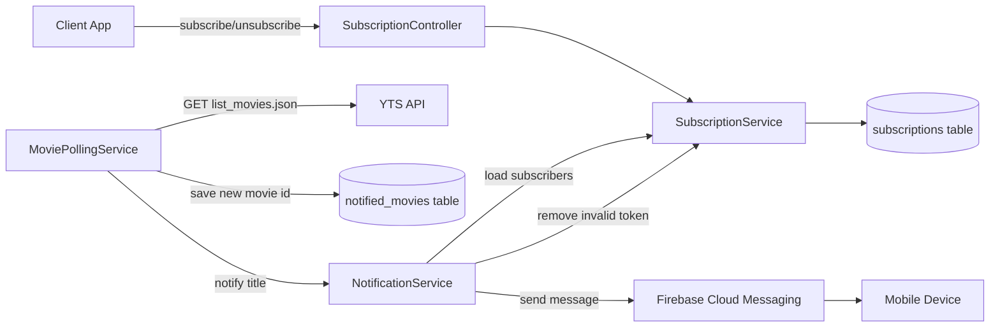
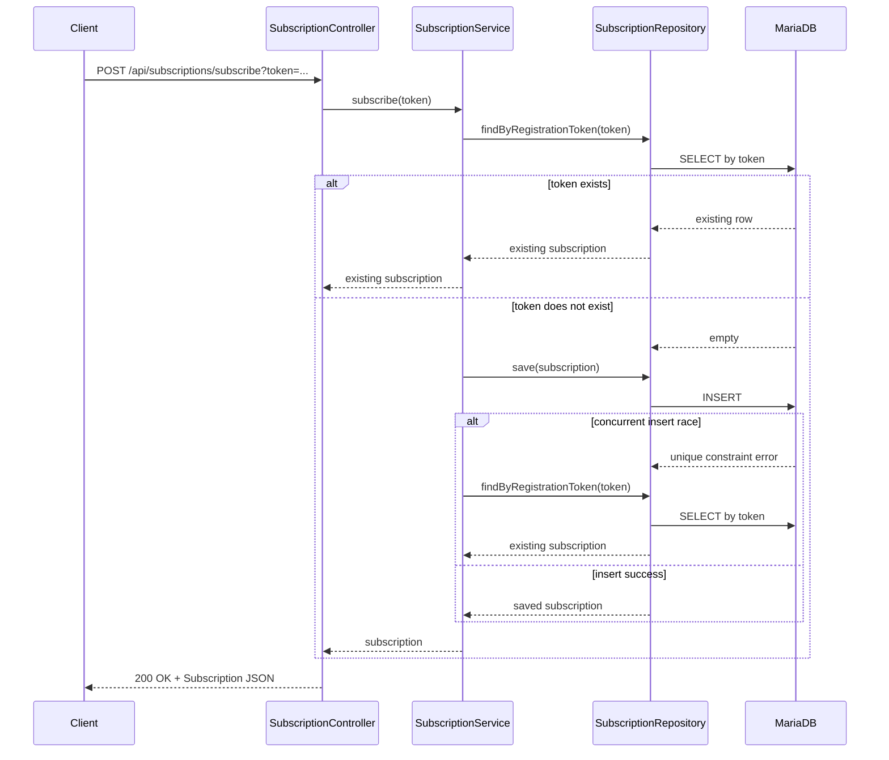
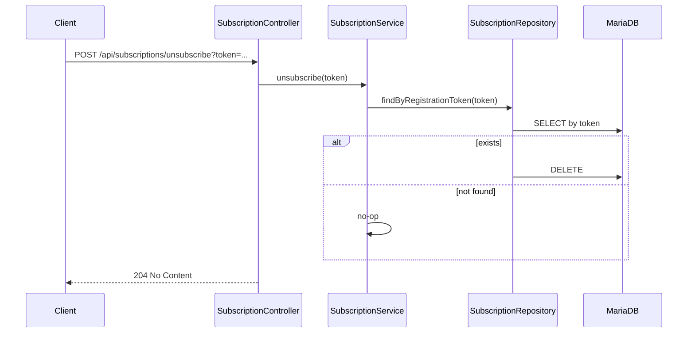
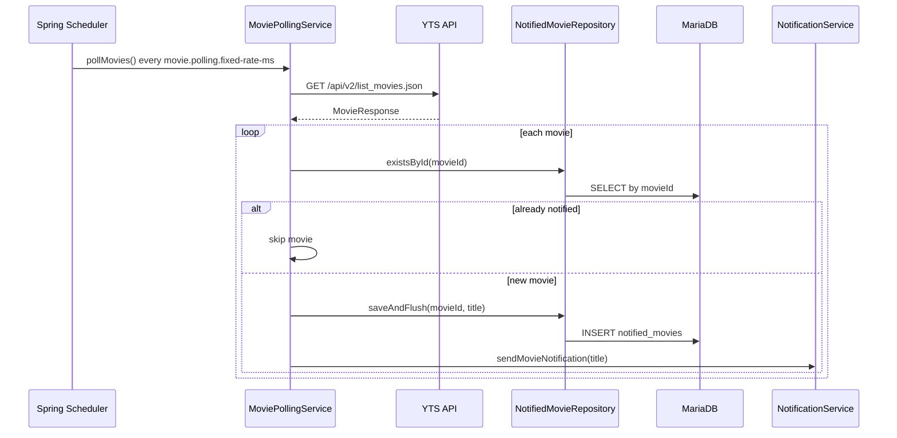
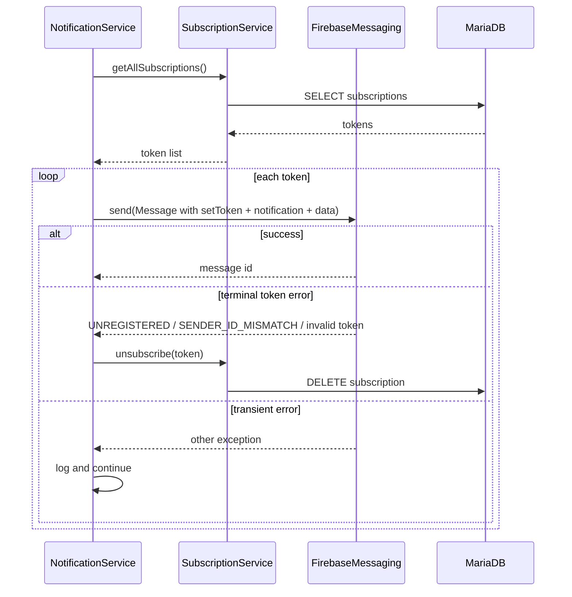

# Movie Notifier

High-performance Spring Boot service that polls YTS and dispatches Firebase Cloud Messaging (FCM) push notifications for new movie releases. Built with Java 25 and GraalVM AOT compilation to support native binaries on both AMD64 and ARM64 (including Raspberry Pi 4).


---

## Table of Contents

- [Overview & Key Features](#overview--key-features)
- [System Architecture](#system-architecture)
- [Project Layout](#project-layout)
- [Service Flows](#service-flows)
  - [1. Subscribe (Idempotent)](#1-subscribe-idempotent)
  - [2. Unsubscribe](#2-unsubscribe)
  - [3. Poll & Deduplicate](#3-poll--deduplicate)
  - [4. Notification Delivery & Self-Healing Tokens](#4-notification-delivery--self-healing-tokens)
- [Quickstart: Local Development](#quickstart-local-development)
- [Configuration Reference](#configuration-reference)
- [REST API Reference](#rest-api-reference)
- [Build and Run](#build-and-run)
  - [JVM Mode](#jvm-mode)
  - [Native AMD64 Build](#native-amd64-build)
  - [Native ARM64 Multi-Arch Build (Docker Buildx)](#native-arm64-multi-arch-build-docker-buildx)
- [Production Deployment](#production-deployment)
  - [Option 1: Docker CLI](#1-docker-run-cli)
  - [Option 2: Docker Compose](#2-docker-compose)
  - [Option 3: Portainer](#3-portainer)
  - [Option 4: Bare-Metal / Linux VM (Systemd)](#4-bare-metal--linux-vm-systemd)
- [Troubleshooting & FAQ](#troubleshooting--faq)
- [Security & Best Practices](#security--best-practices)

---

## Overview & Key Features

- **Scheduled Movie Polling**: Regularly checks the YTS API on a configurable fixed-rate interval.
- **Configurable Quality & Language Filters**: Only dispatches notifications for English movies meeting a configurable minimum IMDb rating threshold (default: `6.5`, raised from 6.0).
- **Duplicate Prevention**: Persists processed movie IDs in a dedicated MariaDB table (`notified_movies`) to prevent duplicate alerts across application restarts.
- **Idempotent Subscription Management**: Devices subscribe via a single REST endpoint; duplicate registrations are handled idempotently even under high concurrency.
- **Self-Healing Token Cleanup**: Automatically prunes stale, unregistered, or uninstalled device tokens when Firebase returns terminal registration errors (`UNREGISTERED`, `SENDER_ID_MISMATCH`).
- **Sub-Second Native Image**: Compiles to a GraalVM native executable with near-instant startup, minimal RAM footprint, and virtual thread readiness.
- **Cross-Platform Native Builds**: Includes an automated Docker Buildx pipeline for producing ARM64 native binaries with conservative CPU baselines (optimized for Raspberry Pi 4).

---

## System Architecture


```mermaid
flowchart LR
    Client[Client App]
    Api[SubscriptionController]
    SubSvc[SubscriptionService]
    SubRepo[(subscriptions table)]
    Poller[MoviePollingService]
    YTS[YTS API]
    NotifiedRepo[(notified_movies table)]
    NotifSvc[NotificationService]
    FCM[Firebase Cloud Messaging]
    Device[Mobile Device]

    Client -->|subscribe/unsubscribe| Api
    Api --> SubSvc
    SubSvc --> SubRepo

    Poller -->|GET list_movies.json| YTS
    Poller -->|save new movie id| NotifiedRepo
    Poller -->|notify title| NotifSvc
    NotifSvc -->|load subscribers| SubSvc
    NotifSvc -->|send message| FCM
    FCM --> Device
    NotifSvc -->|remove invalid token| SubSvc
```

---

## Project Layout

```text
├── build-native.sh                             # Multi-architecture native build script
├── build.gradle                                # Build script, dependencies, and GraalVM settings
├── src/main/java/ar/com/martinrevert/movienotifier/
│   ├── MovieNotifierApplication.java           # Spring Boot application entrypoint
│   ├── config/
│   │   ├── DataSourceConfig.java               # MariaDB Hikari connection pool configuration
│   │   ├── FirebaseConfig.java                 # Firebase Admin SDK initialization
│   │   ├── RestClientConfig.java               # HTTP client logging & setup
│   │   └── SchedulingConfig.java               # Spring task scheduler enabling
│   ├── controller/
│   │   └── SubscriptionController.java         # REST endpoints for subscribe / unsubscribe
│   ├── model/
│   │   ├── MovieResponse.java                  # YTS API response DTO models
│   │   ├── NotifiedMovie.java                  # JPA entity for tracking notified movie IDs
│   │   └── Subscription.java                   # JPA entity for client device tokens
│   ├── repository/
│   │   ├── NotifiedMovieRepository.java        # Spring Data repository for notified movies
│   │   └── SubscriptionRepository.java         # Spring Data repository for subscribers
│   └── service/
│       ├── MoviePollingService.java            # Periodic polling & novel movie detection
│       ├── NotificationService.java            # FCM message dispatching & error handling
│       └── SubscriptionService.java            # Subscription persistence & idempotency handling
└── src/main/resources/
    ├── application.properties                  # Base configuration with environment variable placeholders
    ├── application-local.properties.example    # Template for local developer settings
    └── META-INF/native-image/...               # GraalVM reflection configuration
```

---

## Service Flows

### 1. Subscribe (Idempotent)

Handles new registrations and concurrent duplicate registration races gracefully without throwing unique constraint violations back to clients:


```mermaid
sequenceDiagram
    participant C as Client
    participant Ctrl as SubscriptionController
    participant Svc as SubscriptionService
    participant Repo as SubscriptionRepository
    participant DB as MariaDB

    C->>Ctrl: POST /api/subscriptions/subscribe?token=...
    Ctrl->>Svc: subscribe(token)
    Svc->>Repo: findByRegistrationToken(token)
    Repo->>DB: SELECT by token
    alt token exists
        DB-->>Repo: existing row
        Repo-->>Svc: existing subscription
        Svc-->>Ctrl: existing subscription
    else token does not exist
        DB-->>Repo: empty
        Svc->>Repo: save(subscription)
        Repo->>DB: INSERT
        alt concurrent insert race
            DB-->>Repo: unique constraint error
            Svc->>Repo: findByRegistrationToken(token)
            Repo->>DB: SELECT by token
            Repo-->>Svc: existing subscription
        else insert success
            Repo-->>Svc: saved subscription
        end
        Svc-->>Ctrl: subscription
    end
    Ctrl-->>C: 200 OK + Subscription JSON
```

---

### 2. Unsubscribe

Removes a device token if it exists; no-op if the token is already gone:


```mermaid
sequenceDiagram
    participant C as Client
    participant Ctrl as SubscriptionController
    participant Svc as SubscriptionService
    participant Repo as SubscriptionRepository
    participant DB as MariaDB

    C->>Ctrl: POST /api/subscriptions/unsubscribe?token=...
    Ctrl->>Svc: unsubscribe(token)
    Svc->>Repo: findByRegistrationToken(token)
    Repo->>DB: SELECT by token
    alt exists
        Repo->>DB: DELETE
    else not found
        Svc->>Svc: no-op
    end
    Ctrl-->>C: 204 No Content
```

---

### 3. Poll & Deduplicate

Retrieves the latest releases from YTS, verifies each ID against the database, and only notifies users for previously unseen movies:


```mermaid
sequenceDiagram
    participant Sch as Spring Scheduler
    participant Poll as MoviePollingService
    participant YTS as YTS API
    participant Notified as NotifiedMovieRepository
    participant DB as MariaDB
    participant Notif as NotificationService

    Sch->>Poll: pollMovies() every movie.polling.fixed-rate-ms
    Poll->>YTS: GET /api/v2/list_movies.json
    YTS-->>Poll: MovieResponse
    loop each movie
        Poll->>Notified: existsById(movieId)
        Notified->>DB: SELECT by movieId
        alt already notified
            Poll->>Poll: skip movie
        else new movie
            Poll->>Notified: saveAndFlush(movieId, title)
            Notified->>DB: INSERT notified_movies
            Poll->>Notif: sendMovieNotification(title)
        end
    end
```

---

### 4. Notification Delivery & Self-Healing Tokens

Sends cross-platform push notifications to all registered devices. Terminal error responses from FCM trigger automatic database cleanup:


```mermaid
sequenceDiagram
    participant Notif as NotificationService
    participant SubSvc as SubscriptionService
    participant FCM as FirebaseMessaging
    participant DB as MariaDB

    Notif->>SubSvc: getAllSubscriptions()
    SubSvc->>DB: SELECT subscriptions
    DB-->>SubSvc: tokens
    SubSvc-->>Notif: token list

    loop each token
        Notif->>FCM: send(Message with setToken + notification + data)
        alt success
            FCM-->>Notif: message id
        else terminal token error
            FCM-->>Notif: UNREGISTERED / SENDER_ID_MISMATCH / invalid token
            Notif->>SubSvc: unsubscribe(token)
            SubSvc->>DB: DELETE subscription
        else transient error
            FCM-->>Notif: other exception
            Notif->>Notif: log and continue
        end
    end
```

---

## Quickstart: Local Development

Getting the project running locally takes three quick steps:

### Step 1: Provide Firebase Credentials
1. Go to your [Firebase Console](https://console.firebase.google.com/) > **Project settings** > **Service accounts**.
2. Under **Firebase Admin SDK**, select **Java** and click **Generate new private key**.
3. Save the downloaded file as `serviceAccountKey.json` in the root of your project:
   ```text
   ./serviceAccountKey.json
   ```
   *(This file is already ignored by `.gitignore` to prevent accidental credential commits).*

### Step 2: Configure Local Database Properties
Copy the example properties template:
```bash
cp src/main/resources/application-local.properties.example src/main/resources/application-local.properties
```

Open `src/main/resources/application-local.properties` and adjust your database connection details:
```properties
server.port=10000
firebase.service-account-file=serviceAccountKey.json
movie.polling.min-rating=6.5
spring.datasource.driver-class-name=org.mariadb.jdbc.Driver
spring.datasource.url=jdbc:mariadb://localhost:3306/subscriptions?createDatabaseIfNotExist=true&useSSL=false&allowPublicKeyRetrieval=true&serverTimezone=UTC
spring.datasource.username=your_local_db_user
spring.datasource.password=your_local_db_password
```

> [!TIP]
> `application.properties` includes `spring.config.import=optional:classpath:application-local.properties`. When `application-local.properties` exists locally, Spring Boot imports it automatically without needing command-line profile arguments.

### Step 3: Run the Application
```bash
./gradlew bootRun
```

The application will start Tomcat on port `10000` and immediately perform its first polling cycle.

---

## Configuration Reference

The application follows the 12-Factor methodology. All configuration settings are defined in [`src/main/resources/application.properties`](src/main/resources/application.properties) and can be overridden via environment variables:

| Environment Variable | Property Key | Default / Fallback | Description |
| :--- | :--- | :--- | :--- |
| `SERVER_PORT` | `server.port` | `10000` | HTTP listening port for the REST API |
| `FIREBASE_SERVICE_ACCOUNT_FILE` | `firebase.service-account-file` | `${GOOGLE_APPLICATION_CREDENTIALS}` | Path to Firebase service account JSON |
| `GOOGLE_APPLICATION_CREDENTIALS` | `firebase.service-account-file` | - | Standard GCP credentials path fallback |
| `SPRING_DATASOURCE_DRIVER_CLASS_NAME` | `spring.datasource.driver-class-name` | `org.mariadb.jdbc.Driver` | Database JDBC driver class |
| `SPRING_DATASOURCE_URL` | `spring.datasource.url` | - | Full JDBC connection URL with parameters |
| `SPRING_DATASOURCE_USERNAME` | `spring.datasource.username` | - | Database username |
| `SPRING_DATASOURCE_PASSWORD` | `spring.datasource.password` | - | Database password |
| `MOVIE_MIN_RATING` | `movie.polling.min-rating` | `6.5` | Minimum IMDb rating required to notify movies |
| - | `movie.polling.fixed-rate-ms` | `60000` | YTS polling interval in milliseconds |

---

## REST API Reference

Base path: `/api/subscriptions`

### 1. Register Subscription
Registers a client device token to receive movie push notifications.

- **URL**: `POST /api/subscriptions/subscribe`
- **Query Parameter**: `token=<FCM_REGISTRATION_TOKEN>` (required)
- **Response**: `200 OK`

```bash
curl -X POST "http://localhost:10000/api/subscriptions/subscribe?token=dK9...fcm_token_here"
```

**Success Response Body (`200 OK`)**:
```json
{
  "id": 1,
  "registrationToken": "dK9...fcm_token_here",
  "subscribedAt": "2026-09-08T12:00:00"
}
```

---

### 2. Unsubscribe
Removes a client device token from future notifications.

- **URL**: `POST /api/subscriptions/unsubscribe`
- **Query Parameter**: `token=<FCM_REGISTRATION_TOKEN>` (required)
- **Response**: `204 No Content`

```bash
curl -i -X POST "http://localhost:10000/api/subscriptions/unsubscribe?token=dK9...fcm_token_here"
```

**Validation**:
- Passing a blank or missing `token` parameter returns `400 Bad Request`.

---

## Build and Run

### JVM Mode
Requires Java 25:
```bash
./gradlew clean test
./gradlew bootRun
```

---

### Native AMD64 Build
Compiles a native binary for x86_64 machines (requires GraalVM 25 installed locally):
```bash
./build-native.sh
./build/native/nativeCompile/movie-notifier-native
```

---

### Native ARM64 Multi-Arch Build (Docker Buildx)
Cross-compiles a native binary and packaging an ARM64 container image using Docker Buildx (no local ARM hardware required):

```bash
./build-native.sh aarch64
```

This generates two artifacts in a single build:
1. **Native Binary**: `build/native/nativeCompile/movie-notifier-native` (ARM64 executable).
2. **Docker Image Archive**: `build/native/docker/movie-notifier-native-latest-arm64.tar`.

Load and run the built image locally:
```bash
docker load -i build/native/docker/movie-notifier-native-latest-arm64.tar
```

#### Build Configuration Options:
You can pass custom environment variables to `./build-native.sh`:

| Environment Variable | Default Value | Description |
| :--- | :--- | :--- |
| `IMAGE_REPO` | `movie-notifier-native` | Custom repository/image name for the Docker image |
| `IMAGE_TAG` | `latest` | Image tag for the Docker image |
| `IMAGE_TAR_PATH` | `build/native/docker/...` | Output file path for the exported image archive |
| `ARM64_MARCH` | `compatibility` | CPU baseline instruction set architecture for ARM64 |
| `ARM64_NO_CACHE` | `false` | Set to `true` or pass `--no-cache` to force a clean Docker build |

**Example: Building and publishing to Docker Hub:**
```bash
IMAGE_REPO=your-dockerhub-user/movie-notifier IMAGE_TAG=v1.0.0 ./build-native.sh aarch64
docker load -i build/native/docker/movie-notifier-native-v1.0.0-arm64.tar
docker push your-dockerhub-user/movie-notifier:v1.0.0-arm64
```

> [!IMPORTANT]
> **Raspberry Pi 4 Compatibility**: The default `ARM64_MARCH=compatibility` ensures that GraalVM does not require newer ARMv8.1+ instructions (like `LSE` atomics) that crash on Cortex-A72 processors (Raspberry Pi 4).

---

## Production Deployment

In production, avoid baking secrets into Docker images or committing credentials. Inject credentials via environment variables and read-only secret volume mounts.

### 1. Docker Run (CLI)

```bash
docker run -d \
  --name movie-notifier \
  --restart unless-stopped \
  -p 10000:10000 \
  -e SERVER_PORT=10000 \
  -e SPRING_DATASOURCE_DRIVER_CLASS_NAME=org.mariadb.jdbc.Driver \
  -e SPRING_DATASOURCE_URL="jdbc:mariadb://db-host:3306/subscriptions?createDatabaseIfNotExist=true&useSSL=false&allowPublicKeyRetrieval=true&serverTimezone=UTC" \
  -e SPRING_DATASOURCE_USERNAME="your_db_user" \
  -e SPRING_DATASOURCE_PASSWORD="your_db_password" \
  -e MOVIE_MIN_RATING=6.5 \
  -e FIREBASE_SERVICE_ACCOUNT_FILE="/secrets/serviceAccountKey.json" \
  -v /path/to/production/serviceAccountKey.json:/secrets/serviceAccountKey.json:ro \
  your-repo/movie-notifier-native:latest
```

---

### 2. Docker Compose

```yaml
services:
  movie-notifier:
    image: your-repo/movie-notifier-native:latest
    container_name: movie-notifier
    ports:
      - "10000:10000"
    environment:
      SERVER_PORT: 10000
      SPRING_DATASOURCE_DRIVER_CLASS_NAME: org.mariadb.jdbc.Driver
      SPRING_DATASOURCE_URL: jdbc:mariadb://db-host:3306/subscriptions?createDatabaseIfNotExist=true&useSSL=false&allowPublicKeyRetrieval=true&serverTimezone=UTC
      SPRING_DATASOURCE_USERNAME: your_db_user
      SPRING_DATASOURCE_PASSWORD: your_db_password
      MOVIE_MIN_RATING: 6.5
      FIREBASE_SERVICE_ACCOUNT_FILE: /secrets/serviceAccountKey.json
    volumes:
      - /path/to/production/serviceAccountKey.json:/secrets/serviceAccountKey.json:ro
    restart: unless-stopped
```

---

### 3. Portainer

When deploying using the Portainer Web UI:
1. **Container Image**: Point to `your-repo/movie-notifier-native:latest` (or load your ARM64 archive).
2. **Port mapping**: Map host `10000` to container `10000`.
3. **Environment Variables**: Add:
   - `SERVER_PORT=10000`
   - `SPRING_DATASOURCE_DRIVER_CLASS_NAME=org.mariadb.jdbc.Driver`
   - `SPRING_DATASOURCE_URL=jdbc:mariadb://db-host:3306/subscriptions?createDatabaseIfNotExist=true&useSSL=false&allowPublicKeyRetrieval=true&serverTimezone=UTC`
   - `SPRING_DATASOURCE_USERNAME=your_db_user`
   - `SPRING_DATASOURCE_PASSWORD=your_db_password`
   - `MOVIE_MIN_RATING=6.5` (optional)
   - `FIREBASE_SERVICE_ACCOUNT_FILE=/secrets/serviceAccountKey.json`
4. **Volume Mount**: Bind mount host path `/path/to/serviceAccountKey.json` to container path `/secrets/serviceAccountKey.json` in read-only mode.

---

### 4. Bare-Metal / Linux VM (Systemd)

If executing the native binary directly on a Linux host (Ubuntu, Debian, Raspberry Pi OS):

1. Place the compiled binary in `/opt/movie-notifier/movie-notifier-native` and make it executable:
   ```bash
   sudo chmod +x /opt/movie-notifier/movie-notifier-native
   ```
2. Place `serviceAccountKey.json` in `/opt/movie-notifier/serviceAccountKey.json` and restrict permissions:
   ```bash
   sudo chmod 600 /opt/movie-notifier/serviceAccountKey.json
   ```
3. Create `/etc/systemd/system/movie-notifier.service`:
   ```ini
   [Unit]
   Description=Movie Notifier Native Service
   After=network.target

   [Service]
   Type=simple
   User=movie-notifier
   WorkingDirectory=/opt/movie-notifier
   ExecStart=/opt/movie-notifier/movie-notifier-native
   Environment=SERVER_PORT=10000
   Environment=SPRING_DATASOURCE_DRIVER_CLASS_NAME=org.mariadb.jdbc.Driver
   Environment=SPRING_DATASOURCE_URL=jdbc:mariadb://db-host:3306/subscriptions?createDatabaseIfNotExist=true&useSSL=false&allowPublicKeyRetrieval=true&serverTimezone=UTC
   Environment=SPRING_DATASOURCE_USERNAME=your_db_user
   Environment=SPRING_DATASOURCE_PASSWORD=your_db_password
   Environment=MOVIE_MIN_RATING=6.5
   Environment=FIREBASE_SERVICE_ACCOUNT_FILE=/opt/movie-notifier/serviceAccountKey.json
   Restart=always
   RestartSec=10

   [Install]
   WantedBy=multi-user.target
   ```
4. Start and enable the service:
   ```bash
   sudo systemctl daemon-reload
   sudo systemctl enable --now movie-notifier
   ```

> [!NOTE]
> Spring Boot also supports external configuration files. Any `application.properties` file located in the same directory as the native binary (or in a `./config/` subdirectory) will automatically take precedence.

---

## Troubleshooting & FAQ

### `Task 'runBoot' not found`
- **Cause**: Gradle command typo.
- **Solution**: Use `./gradlew bootRun`.

### Raspberry Pi 4 exits with `required CPU features ... [FP, ASIMD, CRC32, LSE]`
- **Cause**: The native binary was compiled with an instruction set baseline that expects ARMv8.1 Large System Extensions (`LSE`), which the Raspberry Pi 4 Cortex-A72 CPU lacks.
- **Solution**: Recompile using the compatibility baseline:
  ```bash
  ARM64_MARCH=compatibility ./build-native.sh aarch64 --no-cache
  ```

### `Firebase service account file not found`
- **Cause**: The application cannot find a readable file at the path specified by `firebase.service-account-file`.
- **Solution**:
  - In local development: Place `serviceAccountKey.json` in the root folder.
  - In Docker: Ensure your volume mount matches `FIREBASE_SERVICE_ACCOUNT_FILE` (e.g. `/secrets/serviceAccountKey.json`).

### FCM dispatch returns recipient / token errors
- **Cause**: The client registration token is invalid, expired, or belongs to a different Firebase Project than the private key in `serviceAccountKey.json`.
- **Solution**: Verify that client apps connect to the same Firebase project whose credentials are used by the backend. The service will automatically delete tokens that return terminal errors.

### Duplicate pushes after service restart
- **Cause**: The `notified_movies` table was cleared or recreated.
- **Solution**: Ensure your database is persistent and that `spring.jpa.hibernate.ddl-auto` is set to `update` (never `create` or `create-drop` in production).

---

## Security & Best Practices

- **Never Commit Secrets**: Ensure `serviceAccountKey.json` and `src/main/resources/application-local.properties` remain in [.gitignore](.gitignore).
- **Read-Only Secret Mounts**: When deploying via Docker or Kubernetes, mount the service account credential with `:ro` (read-only) permissions.
- **Least Privilege DB Users**: Create a dedicated database user with permissions scoped exclusively to the `subscriptions` database.
